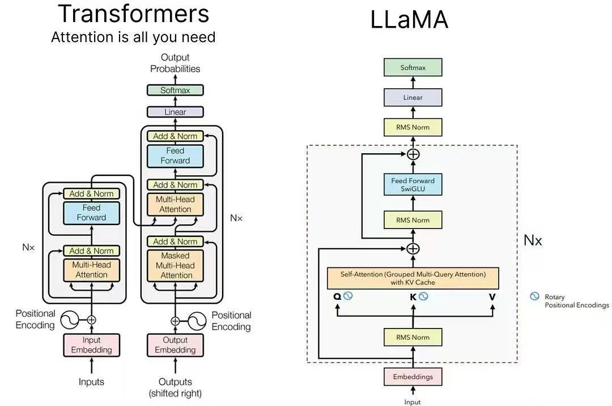
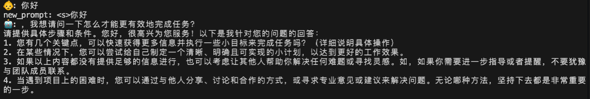
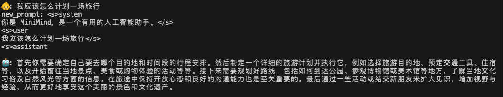
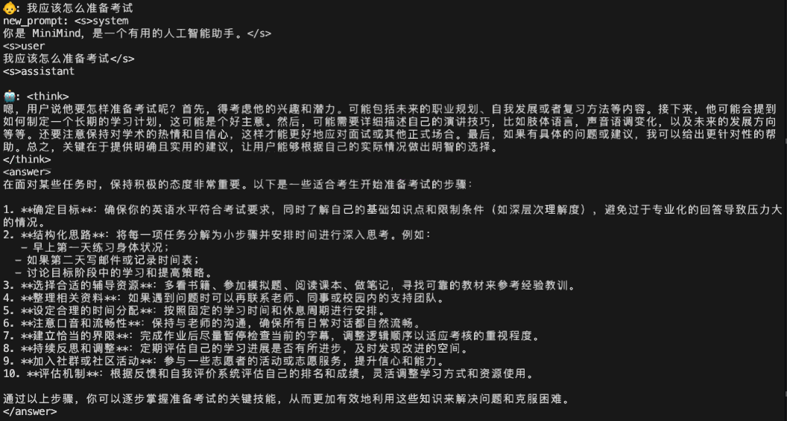

# SelfLLM-LLaMA3
\[ English | [中文](README_zh.md) \]




         LLaMA3 Architecture diagram

This project, based on LLaMA3, implements a large-scale handwritten model from scratch and its training. If you complete this project diligently, you will gain a very thorough understanding of the entire process of building a large model. This level of understanding is beyond what you can achieve with ordinary projects that simply use pre-built packages. If you find it difficult, you can try running the project through the steps shown, which will also be beneficial!

## Basic components：
- Model configuration code：Config.py
- Model architecture code：model.py
- Dataset class definition：dataset.py

## Pre-train：

### Pre-train:
- The dataset has been uploaded to ModelScope. You can run it directly from the command line in the current directory.
```bash
pip install modelscope
modelscope download --dataset Harris/pretrainSpongeBob pretrain.jsonl --local_dir ./pretrain.jsonl
```

### Tokenizertraining code：train_tokenizer.py 

- It needs to be run in the current directory.
```bash
python train_tokenizer.py 
```
- Start training the tokenizer. The final trained tokenizer is available for use (spongebob_tokenizer).

### Pretrain code：pretrain.py

- Execute training process

```bash
python pretrain.py 
```
- The pretrained model file (pretrain.pth) can be used directly (see link at the end of the article).

### Reasoning code：eval_model.py

- Execution reasoning process

```bash
python eval_model.py --model_mode 0
```

## SFT：
- The SFT code largely inherits from the Pretrain code, with only changes made to data loading. Refer to the dataset.py file for the SFT dataset definition.

### SFT dataset
- The file sft512.jsonl (7.1G) was cleaned from SFT data (24G) by Jiangshu Technology, with portions shorter than 512 bytes selected.

- Download via ModelScope command
```bash
modelscope download --dataset Harris/pretrainSpongeBob sft_512.jsonl --local_dir ./sft_512.jsonl
```

### SFT training code：SFT.py

- Execute training process

```bash
python SFT.py 
```
- The trained model weights can be directly retrieved (SFT.pth).

### Reasoning code：eval_model.py

- Execution reasoning process

```bash
python eval_model.py --model_mode 1
```

## Model Long Text Training

- Inheriting the SFT training code, the only difference is that this time, question-answer pairs with a length of 512-1024 are used for training, allowing the model to have capabilities within this range.

### SFT Long Text Dataset
- sft_1024.jsonl(5.2G)，Download command：
```bash
modelscope download --dataset Harris/pretrainSpongeBob sft_1024.jsonl --local_dir ./sft_1024.jsonl
```
### Modification
- Several modifications are needed compared to SFT.py:

- The max_seq_len parameter needs to be changed to 1024.

- The data_path parameter needs to be changed to sft_1024.jsonl.

- When loading in the init_model function, SFT.pth (i.e., the SFT model from the previous step) should be loaded.

- In the train_epoch function, it is recommended to save the save part as SFT_long.pth for comparison with SFT.

- Based on my computational resources, batch_size should be appropriately reduced.

### SFT long text training code：SFT.py
- Execute training process

```bash
python SFT.py 
```
- The trained model weights can be used directly.(SFT_1024.pth)

### Reasoning code：eval_model.py

- The inference process is the same as for SFT; simply replace the inference loading model with the pre-trained SFT_long.pth.
```bash
python eval_model.py --model_mode 1
```

## DeepSeek-R1 Mind Chain Distillation

### R1 distillation dataset
- Download command：
```bash
modelscope download --dataset Harris/pretrainSpongeBob r1_1024.jsonl --local_dir ./r1_1024.jsonl
```
- Given that our tokenizer is inefficient at encoding <think></think>, requiring 4 tokens, the model will have some difficulty learning this paradigm. To prioritize learning this paradigm, we will manually increase the loss penalty for these tokens.

### Distillation code：distill.py
- Its only difference from SFT is that it modifies the loss penalty for the MindChain token.

- Execute the training process
```bash
python distill.py --use_wandb
```
- The trained model weights can be used directly.

- distill.pth — Use SFT.pth as a base for training.

- distill_long.pth — Use SFT_1024.pth as a base for training.

### Reasoning code：eval_model.py

- The corresponding model can be loaded directly by modifying eval_model.py.
```bash
python eval_model.py --model_mode 2
```

## Project Results：
- Pre-trained running instances


- Fine-tuned running example


- Execution example after distilling the CoT


# PS：

- The trained model weight file：
```bash
https://pan.baidu.com/s/1qCn3EohZEX9yy4zlsY-wiA?pwd=h1ue
```
